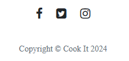
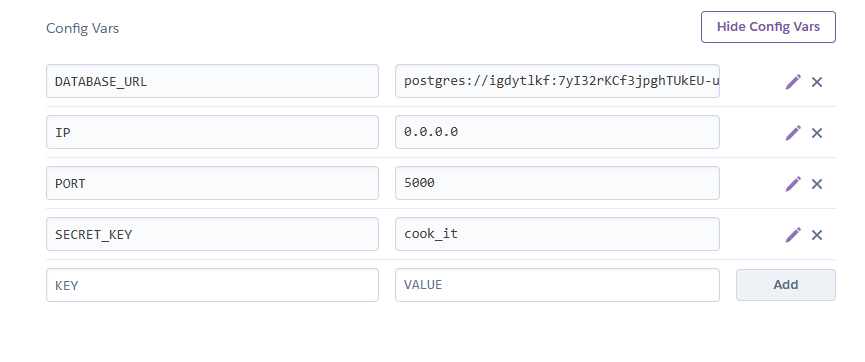

 
 

# Cook It

 

*"Cook it" is a vibrant online hub dedicated to dessert cooks. With a diverse range of dessert recipes, culinary tips, and a welcoming community, "Cook it" provides an engaging platform for anyone passionate about baking and sweet treats.*

 

## Table of Contents

 

- [Project Overview](#project-overview)
- [Live Site](#live-site)
- [Repository](#repository)
- [Author](#author)
- [Target Audience](#target-audience)
- [Project Goals](#project-goals)
- [User Stories](#user-stories)
- [Developer](#developer)
- [Design choices](#design-choices)
- [Wireframes](#wireframes)
- [Features](#features)
- [Interactive Design Elements](#interactive-design-elements)
- [Implemented features](#implemented-features)
- [Future features](#future-features)
- [Version Control](#version-control)
- [Testing](#testing)
- [Accessibility Testing](#accessibility-testing)
- [Examples of Responsive design](#examples-of-responsive-design)
- [Defects list](#defects-list)
- [Outstanding defects](#outstanding-defects)
- [Technologies used](#technologies-used)
- [Deployment](#deployment)
- [Credits](#credits)
- [Content and Media](#content-and-media)
- [Acknowledgements](#acknowledgements)

 

## Project Overview

 

"Cook it" is aimed at dessert enthusiasts of all skill levels, from amateur home cooks to seasoned bakers. Whether you're looking to discover new dessert recipes, share your own culinary creations, engage with a vibrant community of like-minded individuals, or simply indulge your sweet tooth, "Cook it" provides a welcoming and inclusive platform for everyone passionate about desserts

 

## Live Site

- https://cook-it-31a1cb906548.herokuapp.com/

 

## Repository

- https://github.com/MrHraza/Cook-it

 

## Author

Developer  -  *Husnain Raza*

 

## Target Audience

 

*   **Dessert Enthusiasts:** Individuals who have a passion for desserts and enjoy exploring new recipes, techniques, and flavor combinations.
    
*   **Home Cooks:** People who love to bake and create delicious desserts in the comfort of their own kitchens, ranging from beginners to experienced home cooks.
    
*   **Food Bloggers and Influencers:** Content creators who specialize in sharing food-related content, including dessert recipes, cooking tutorials, and culinary tips.
    
*   **Culinary Enthusiasts:** Individuals who have a general interest in cooking and baking and are eager to expand their culinary repertoire with sweet treats.
    
*   **Community-Minded Individuals:** People who value online communities and enjoy engaging with others who share similar interests, such as exchanging recipe ideas, providing feedback, and participating in discussions about desserts.

  
 

## Project Goals

 

1. **Showcase Skills:** Demonstrate skills using coding languages; html, css, javascript, python, flask, jinja.

2. **User-Friendly Design:** Create an appealing website layout that ensures easy navigation for visitors, allowing them to access information effortlessly.

3. **Professional Presentation:** Craft a professional online presence for Husnain, incorporating a clean design, well-organized content, and easy-to-read sections, such as about me, and experience and referneces.

4. **Mobile Responsiveness:** Ensure the website is responsive across various devices, including smartphones, tablets, and desktops, optimizing the user experience for all visitors.

5. **Call-to-Action (CTA):** Include clear call-to-action elements, such as a contact form or buttons and prompting visitors to engage further.
   
 

## User Stories

 

Create a website that allows people to combine their passion for baking with their desire to connect with others, share knowledge and expertise, and potentially pursue entrepreneurial opportunities in the culinary/food industry.

 

## Developer

 

As a Developer I want to push myself and demonstrate my ability with different coding languages in combination.

 

## Design choices

 

#### Colours

In this project, the color palette, I chose, consisting of black, white, light grey, and dark grey evokes a sleek, modern, and sophisticated aesthetic. 

This combination often conveys a sense of professionalism, elegance, and minimalism. 

It may also elude to a theme of sophistication and refinement, appealing to users who appreciate clean and contemporary design. 

Additionally, it can create a sense of balance and clarity, allowing the *focus* to remain on the content, whether it's showcasing mouthwatering dessert images or providing insightful baking tips.

 

#### Typography

I used two fonts on this website for their combined effect; Lora and Times New Roman.

*   **Lora:** This is a serif font with a modern twist. Its graceful curves and balanced proportions provide a touch of sophistication while maintaining readability. Lora's versatility makes it suitable for both body text and headings.
    
*   **Times New Roman:** This is a well-known serif font that exudes tradition and professionalism. Its clean lines and distinctive letterforms make it highly legible, especially in longer passages of text. Times New Roman is often associated with formal documents and publications, giving the website a polished and authoritative feel.

Thus, by combining Lora and Times New Roman, one can create a harmonious typographic palette that enhances the overall visual appeal. Lora adds a contemporary flair, while Times New Roman brings a sense of familiarity and credibility, resulting in a refined and inviting user experience.

 

#### Imagery

Four images in total of the finished dessert of the given recipe can be seen on the website.

 

#### Site Structure

I have opted for a multi-page website as this offers flexibility, organization, and scalability, making it an effective platform for "Cook it" to showcase its diverse range of dessert recipes, culinary resources, and community engagement features to its audience.

 

## Wireframes

 

- desktop > general template to follow for all pages

- tablet/phone > general template to follow for all pages

 

## Features

 

From the user stories I have understood that what the client requires is a website that showcases the following:

*Clean and Intuitive Design:*
- Visually appealing layout with adequate white space. Easy-to-read fonts and appropriate font sizes. Consistent color scheme that complements the content.

*Clear Navigation:* 
- Intuitive menu or navigation bar for easy access to different pages.
  
*Different pages:* 
- Namely; About, contact, community/forum.

*Visual Enhancements:*
- High-quality images, that are relevant and add value.
  
*Mobile Responsiveness:*
- Optimized for various devices, ensuring a seamless experience on mobile.
  
*Social Media Integration:*
- Links to relevant social media (Twitter, facebook, Instagram etc.).

*Call-to-Action (CTA):*
- A clear CTA for users i.e contact form.

 

## Interactive Design Elements

 

**menu**  
- Hovering over a menu item *subtly* (see 'contact us') hightlights the item.

**Buttons** 
- Working/linked buttons are used on the website (see 'edit' or 'delete' on the community page).

**Contact form**
- This is a working contact form that is connected to the clients Gmail account allowing him to respond to messages.

Then sent.

**Social links**
- Cook it socials can be found here, hovering over twitter to highlight.

 

## Implemented features

 

**header**
- This contains a navigation element in the form of a menu, when using on a tablet or a mobile device this changes to a drop-down menu.
  
**Easy desserts section on homepage**
- Features an accordian, this dropped-down segment shows the recipe of the dessert.
  
**Contact page**
- Features a contact form.

**User accounts**
- Sign up, login and leave your recipes/comments.
  
**Community page**
- Features a working comments section, where comments can be edited or deleted.
  
**footer with socials.**
- Social links to website's social media platform.

 

## Future features

 

1. enhanced forum, for a better community experience. Users could create threads and sub-topics.
2. regular dessert recipe updates, more recipes.
3. Industry recommendations, recommended tools to use. i.e cooking utensils.
4. video tutorials, show users visually how to make things/tips and tricks.
5. Newsletters, for extra updates.

 

## Version Control

 

I am definitly not happy with this project. I absolutely feel I had more to offer I had many great thoughts on how to improve my intial idea for the project. However a few of the final lessons on this part of the course were taught too fast which meant I had to review them several times. I found it was taught at 100mph (as did every student I found on slack!). Furthermore close to the deadline my computer was affected by a virus, which didn't let me start up my computer. I bought a new laptop to continue my project with a short amount of time remaining. I resigned to cut off the inclusion of a database and tried to refine and polish the code as best that I know. I have also tried to keep up with regular commitments. 

 

## Testing

### Validation html 

- I Cannot run a validation on my html documents because they are mixed with flask and jinja code and throw errors.

### Validation css

- cookit.css

## Accessibility Testing

#### Colour contrast accessibility testing

 

 

#### Lighthouse

 

- index.html 

(desktop) 

(mobile)

- about.html 

(desktop) 

(mobile)

- contact.html 

(desktop) 

(mobile)

- community.html 

(desktop) 

(mobile)

 

## Examples of Responsive design

 

- laptop

- Ipad Air

- ipad mini

*menu has been opened*

- iphone 14 pro max

- samsung galaxy s20 ultra

 

## Defects list

 

*On smaller screens the layout could do with some more organising, for a more user friendly experience.
*Also the accordian on the homepage, on smaller screens could be better.
*NOT a defect but the login page is not coded. Used only as a future feature.

 

## Technologies used

#### Programming Languages

 

- CSS 
- HTML 
- Flask
- SQLAlchemy
- Jinja
- python
- JS 
- Markdown

 

#### Frameworks and Extensions

 

- Bootstrap 4.7.0

 

#### Icons

 

- FontAwesome 4.7

 

#### Tools

 

- Github
- Gitpod
- Visual Studio
- Pen and paper
- Internet
- Markdown table of contents generator
- Favicon

 

## Deployment

#### Follow the steps to deploy on Github pages. 

1. From working in gitpod or anycoding space, create both a 'Procfile' and a 'requirements.txt' file.
   
   

2. Open heroku, and create a new app.
3. Navigate to the 'settings', finding 'Config vars'. Here add your configuration information. see example below.

4. Find the deploy tab on the submenu at the top of the heroku page. Locate the deploy section on the page, either automatic or manual. Select Github and enter the name of your repository. Confirm and connect.
   

5. Scroll to the top of the heroku page and find 'Open app'. If successfully deployed your website should follow.

 

## Credits

 

- Code Institute Introduction to flask
- Code Institutes Relational database walkthrough project
- Code institute Lessons

 

## Content and Media

#### The following websites were visited for inspiration/ideas;

- https://www.startbootstrap.com/ - used a template layout and adjusted as needed.

#### Icons

 

- https://fontawesome.com/v4/icons/

 

#### All images were taken from;

 

- www.bbcgoodfood.com
- www.pngegg.com - Favicon "cook book"

 

#### Code related ideas;

 

- https://codepen.io
- Code Institutes lessons
- https://www.w3schools.com/

 

## Acknowledgements
- https://www.site24x7.com/tools/javascript-validator.html
- CodeInstitute template
- **Malia Havlicek - mentor**
- Chrome Developer Tools
- https://color.a11y.com/
- https://www.w3schools.com/
- https://slack.com/
- https://ui.dev/amiresponsive
- https://jigsaw.w3.org/css-validator/
- Lighthouse
- Windows screen reader

